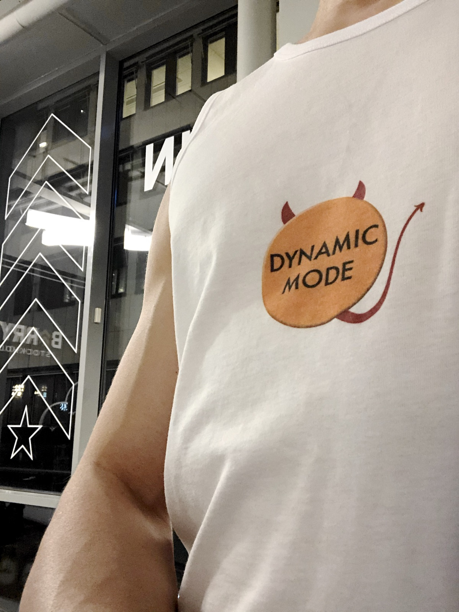

### Since my last update in October…

- Life is great. I read my update from a year ago. While things were on the upswing then, I was still dealing with a big hurt. (I’m not going into the details publicly, but it was professional, not personal.) More than time was necessary to heal that wound, but I truly am stronger because of the experience. I am content and happy and optimistic about the future.
-  The kitchen remodel is 99% done! It took twice as long to complete than estimated and cost twice as much as we budgeted, but Arthur and I love the outcome. Arthur has his dream kitchen. The color is bold and the design is modern. The layout is much improved with consideration to multiple people preparing a meal. The space is used more efficiently, with increased storage and a usable pantry. [_More pics_](https://www.brittfurn.se/i/projekt/mannagrynstorget.html)
    - This was our first remodel. Living out of our bedroom and bathroom for over 2 months sucked more than we anticipated. Dust covered everything. Our floors were covered in paper. We had to wear shoes inside. Our schedule was determined by when people would be showing up to work. The masons installed the wrong stone and had to do a second demolition. No one could figure out how to turn off the water line to our island, so we had to move the island like a plot line in *Lost*. Hope that line never springs a leak…
- I concluded my 18-month interim role at InVision. I helped hire my product manager and engineering manager replacements. My team found a regular delivery cadence, improved quality, and shifted from an urgent to sustainable pace. I got to directly promote someone for the first time and that was a joyous feeling. Now, I am back to the team I was originally hired for and am excited to work on some key internal services. Someone recently called me “positive and pragmatic” and I love that.
- Arthur & I went to Dublin, Ireland in November for a live recording of his favorite podcast, [“My Favorite Murder”](https://www.myfavoritemurder.com/). We met up with his cousin, who happened to be in Dublin serendipitously, and two of his coworkers, who also went to the podcast show. Arthur bought “first degree” tickets, so we got to meet Karen and Georgia. They are as lovely and gracious in person as they are on the podcast. Arthur made “Murder She Wrote” meme shirts.
    - Being that it was my first visit to Ireland, I wanted to do some cultural tourism. We went on a boat tour through the city. The bridges are named after Dublin’s famous authors and rebels. They make for a useful narrative framework to tell Ireland’s history as a Viking port, its independence, and its escape culturally from Catholicism. I most enjoyed [The Icon Walk](https://iconfactorydublin.com/the-icon-walk), a telling of Dublin’s history through street art.
    - Misery Hill was the site of public executions in the 1700s. Criminals were hanged on this hill as a warning to incoming trading ships. Today, Facebook's headquarters is located at 1 Misery Hill, which is fitting. Facebook uses a back entrance as its official address.
- Arthur & I went to Morocco in December. Arthur’s former coworker and our all-around-awesome friend, Kathe, decided to celebrate her 50th birthday by planning an adventure and inviting her friends along. We spent an unforgettable week with a group of 8 others, none of whom we knew prior except for Kathe and her husband.
    - We negotiated our way through the tiny medina quarters of Marakesh and Fez. We went on a road trip to and from the Sahara Desert, where we camped. As Arthur drove one of the 8-passenger vans for nearly 24 hours over 4 days, I played Oprah and asked probing questions to learn how fascinating and inspiring the other birthday adventure guests were. We rode camels and watched a perfect sunset from a sand dune. We wished to be back on the camels when our guide nearly rolled his tiny Toyota SUV while driving on the steep dunes. We learned to cook tajine. We encountered wild donkeys and learned they are adorable. We talked politics and life with Moroccans of Arab and Amazigh descent. We played football with the happiest children of nomads. We drank the strongest and sweetest mint tea I’ve ever tasted, everyday. When we encountered the horrors of pit squat toilets, we practiced gratitude for modern plumbing and hand sanitizer. We hid being gay by taking lesbian wives, but still managed to find a fellow queer through some select word choices and knowing glances. We danced with belly dancers in a country where women wear headscarves. We played castanets and drums around a fire. We cried a little and laughed a lot.
- Arthur and I celebrated his birthday with dinner at [Oaxen Krog](https://oaxen.com/en/). It could very well be named Swedish Laundry, as it was an experience much like dinner at French Laundry. Both of these restaurants are incredible experiences where the only negative is being too much of a good thing. It’s worth doing once in your life and I was happy to share it with Arthur on a special occasion.
- This Christmas was the first time Arthur and I stayed home. It was nice to observe the winter traditions on our terms. Since our kitchen was finished just in time, we hosted a party for Arthur’s coworkers, a few friends, and our neighbors (very un-Swedish!). Our American friend Dave stayed with us since his family was observing the holiday later. Our Swedish friend Nico invited us to his family’s Christmas Eve dinner. We were honored to be guests at what Swedes consider an intimate and important family occasion. We celebrated Christmas morning at home, made veggie piggies in blankets, and exchanged a few presents under the most beautiful tree we have ever had. Arthur and Dave made a beef wellington for them and a beet wellington for me. It was _so_ delicious
- We rang in 2020 with fika with Petter, Ylva, and their little one, dinner with our friend Vivien, and watching the fireworks in front of the palace from Spotify’s office roof deck.
- I celebrated my birthday with dinner at [Rutabaga](https://www.grandhotel.se/en/food-beverage/mathias-dahlgren/rutabaga) with Arthur. Go there if you want to experience an unapologetic vegan tasting menu with a perfect non-alcoholic beverage pairing.
- Quickies:
    - My digital nomad friend Mitch surprised me with tickets to Cher. After the concert, we hung out with her opening act, [Bright Lights Bright Lights](https://songwhip.com/artist/bright-light-bright-light), and her dancers. I ended up meeting another artist I like from [The Sound of Arrows](https://songwhip.com/artist/the-sound-of-arrows). He’s based on Stockholm and we since have had a few dinners with his lovely husband and dog.
    - I attended [ServerlessDays Stockholm](https://www.eventbrite.se/e/serverlessdays-stockholm-2019-tickets-61419254644) conference on Oct 24. Serverless is cool, but setting up Amazon Web Services to use serverless is not.
    - I celebrated Halloween at Barry’s Stockholm. I made a tanktop with the scariest thing in the red room: the dynamic mode button on the treadmills.
    - Arthur, Vivien, and I attended [TEDxStockholm](https://tedxstockholm.com/) on Nov 16.
    - Leah visited Stockholm for the first time since moving to NYC and it was so lovely to spend an evening with her again
    - Vivien and I joined Greta for the last #FridaysForTheFuture protest in 2019.
    - I celebrated Rafaela’s birthday with dancing and Katja's birthday with pizza and, per German tradition, too much alcohol.
    - I watched _The Bachelor_ premier with Sophie and Gina.
    - I went to a delicious and fun dinner party hosted by Alex and Jerry. We made notable progress through The Bigger, Blacker Box of Cards Against Humanity.

### 2019 goal recap

- **Lift 4–5× a week:** Went well! Total success! This was the first year in which I felt comfortable wearing a tanktop while working out. It’s a nice feeling.
- **Learn Swedish:** I did well with daily practice for 6 months. I increased my vocabulary significantly. I can read and often understand some context. My motivation decreased steadily over the year. Given the right and left political parties in Swedish parliament want to make immigration harder, I need to prioritize this in 2020. I have tried all the apps. Learning a language is hard and sucks and is constantly discouraging. I need to try something other than apps.
- **Complete 12 side projects in 12 months:** I didn't finish 12 projects, but I am happy with the 10 I completed and for getting back into a habit of creating for myself.
    1. [Firefox extension: Tab Tosser](/posts/introducing-tab-tosser/)
    2. [Tab Tosser logo and marketing site](/tab-tosser/)
    3. Unreleased Firefox extension (completed, but it didn't achieve the product objective)
    4. [Fitbit watchface: Pride Ripple](https://gallery.fitbit.com/details/e9f93783-42d4-4e7d-ba57-9a2cfce9ebc7)
    5. [LGBTQ+ Pride Month brand archive](https://github.com/jeremiahlee/pride-archive)
    6. [Warren for President social media header images](https://github.com/jeremiahlee/warren-for-president)
    7. Convert personal site to [Eleventy](https://www.11ty.io/) static site generator and [Tailwind CSS](https://tailwindcss.com/)
    8. My kitchen remodel and the hundreds of decisions that had to be made for it
    9. Established 5 Wikipedia articles on notable Ferris wheels
        - [SkyWheel Helsinki](https://en.wikipedia.org/wiki/SkyWheel_Helsinki)
        - [SkyView de Pier](https://en.wikipedia.org/wiki/SkyView_de_Pier)
        - [SkyView Rotterdam](https://en.wikipedia.org/wiki/SkyView_Rotterdam)
        - [Grande Roue de Marseille](https://en.wikipedia.org/wiki/Grande_Roue_de_Marseille)
        - [Amber Sky](https://en.wikipedia.org/wiki/Amber_Sky)
    10. Curated [Sun of Stockholm](https://twitter.com/sunofstockholm), the Stockholm edition of [Sun of Seldo](https://twitter.com/sunofseldo)
- **Read 12 books (and read less news):** When I set this goal, it was before [Apple News+](https://www.apple.com/apple-news/) came out. I love it and started reading long form journalism in magazines multiple times a week. Overall, I read more thoughtful writing and far less real time news. I am better for this.
    1. “Becoming” by Michelle Obama _(recommended)_
    2. “Our Revolution” by Bernie Sanders
    3. “Zucked” by Roger McNamee _(highly recommended)_
    4. “Utopia for Realists” by Rutger Bregman _(highly recommended)_
    5. “A Fighting Chance” by Elizabeth Warren _(recommended)_
    6. “An Elegant Puzzle: Systems of Engineering Management” by Will Larson _(recommended if professionally relevant)_
    7. “The Obstacle is the Way” by Ryan Holiday _(highly recommended)_
    8. “The Design of Web APIs” by Arnaud Lauret _(highly recommended if professionally relevant)_
    9. “Design and Build Great Web APIs” (Sept 26, 2019 early access version) by Mike Amundsen
    10. “APIs: A Strategy Guide” by Daniel Jacobson, Greg Brail, Dan Woods
    11. “The Don’t Represent Us” by Lawrence Lessig _(highly recommended)_
    12. “The Almost Nearly Perfect People” by Michael Booth

### Up next

In 2019, I used quantities of things in a specific areas to help establish habits. In 2020, I want to go deeper on fewer things. Per usual, I have a list far too long of ideas that interest me. I am not yet ready to pick or share publicly. Here is what is for certain:

- Fitness remains a primary goal. I will continue my regular Barry’s classes, but would like to do more cycling around Stockholm.
- Read [“The Daily Stoic”](https://www.goodreads.com/book/show/29093292-the-daily-stoic) every day.
- Learn Svenska.
- Strengthen and increase local friendships.
- Share more ideas. I have tens of blog posts in a draft state. I want to finish and publish them this year.
- Plan more home decorations and renovations for 2021. Hopefully by then, Arthur and I will have the cash and fortitude to endure them.
- Update the [Pride Flags watchface for Fitbit](https://gallery.fitbit.com/details/a8195bb6-649a-45be-8f0c-9ca68af7c130) with more flags and support for the always on display of the Versa 2.

### Long term goals

- Ride a Ferris wheel in every European country: Barcelona, Vienna, London, Helsinki
- Make a loan to all Kiva countries: 65 of 75—and there are no loans available in the rest of the countries, so goal complete for now. ([Join me!](https://www.kiva.org/invitedby/jeremiahlee))

