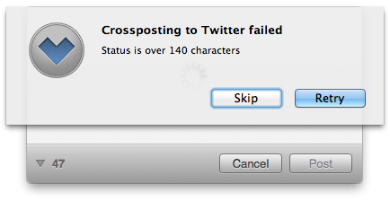
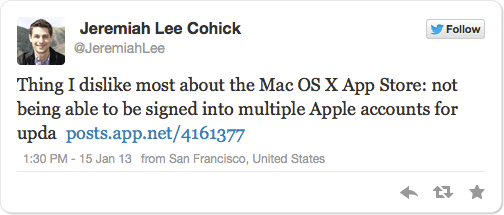
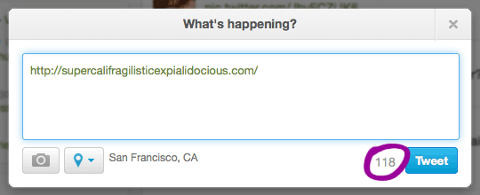
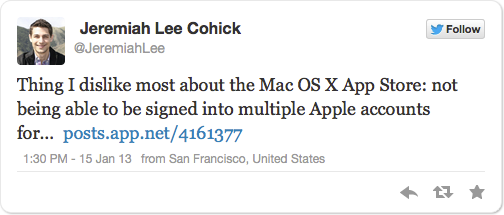
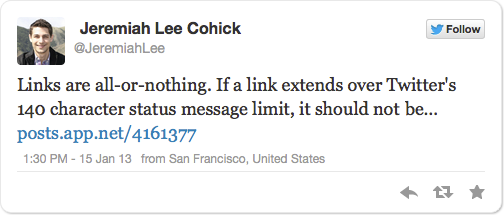
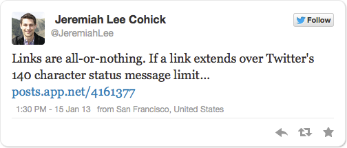
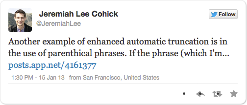
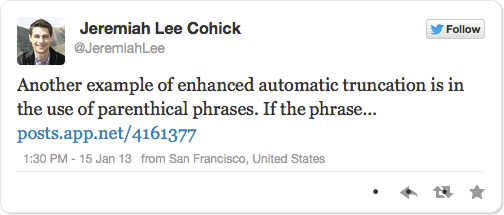

[App.net](https://join.app.net/) is a freemium, paid alternative to Twitter. _(Need an [invite](https://join.app.net/from/hsxwhpckmv)?)_ Many third-party Twitter developers released App.net versions of their software when Twitter changed its API policies<a href="#footnote-1">1</a> to prevent unofficial Twitter clients from gaining popularity<a href="#footnote-2">2</a>. Understanding that adoption of App.net would take time, many App.net clients allow users to post simultaneously to App.net and Twitter.<a href="#footnote-3">3</a>

However, seemingly small differences between App.net and Twitter have resulted in a suboptimal user experience when using the cross-posting functionality. There are two primary differences between the services that App.net clients must account for when cross-posting to Twitter: maximum status message length and how URI length is calculated.

## Status Message Length Problem

App.net supports status messages up to 256 characters. Twitter only supports status messages up to 140 characters. When a status message exceeds 140 characters, App.net clients must decide how to proceed.

Some App.net clients abandon the user.

Other App.net clients truncate the status message and link to the original App.net status.<figure>

 <figcaption class="small">Tweet containing a link to the original App.net status message because the message was too long for Twitter. The status message was truncated mid-word by this App.net client.</figcaption> </figure>

## Twitter Link Length Calculation Problem

The second difference is in how Twitter counts the number of characters in a link. Regardless of actual length, links on Twitter count as 22 characters (or 23 characters if the link uses HTTPS)<a href="#4">4</a>. Twitter, behind the scenes, converts all links to its t.co link wrapper. Even though Twitter displays links as they were originally shared, when you click on a link from Twitter, you can briefly see a t.co link redirect your browser in the browser’s address bar.

None of the App.net clients that I have used accommodate Twitter’s link length calculation. Ignoring how Twitter counts the characters in a link results in original links shorter than 22 characters being undercounted by the App.net client and the Twitter API potentially rejecting a status message for being too long. It also means links longer than 22 characters take away more characters than necessary from the rest of the status message.

# Workflow workarounds suck

This suboptimal behavior has led to me, as a user, untrusting of the cross-posting feature. My workflow currently looks like this:

1. Composing status messages in a Twitter client (usually [Tweetbot](http://tapbots.com/software/tweetbot/) to check for proper length.
2. Copying the text from Tweetbot.
3. Pasting into an App.net client (usually [Wedge](http://wedge.natestedman.com/) on my Mac and [Netbot](http://tapbots.com/software/netbot/) on my iPhone).
4. Verifying that the total character length with actual link length is under 140 characters for proper cross-posting to Twitter because the App.net client doesn’t consider Twitter’s link calculation. And because App.net clients only show _remaining_ characters in a status message, I have to do the math &ldquo;256-140=116&rdquo; to know if I’m within Twitter’s character limit.
5. Submitting the status message in the App.net client.
6. Double checking the status message appeared properly on Twitter because I don’t trust my math.</ol>

This workflow only works for users who are really, really committed to App.net.

# Solutions

My proposed interaction design requirements:

1. App.net clients should respect Twitter’s link counting rules when cross-posting
2. App.net clients should automatically and elegantly truncate status messages exceeding Twitter’s character limit
3. App.net clients should inform the user when a status message will be truncated when cross-posted to Twitter
4. App.net clients should allow users to specify a truncation point

## Demonstration Video

<video controls="controls" preload="none" poster="adn-twitter-crosspost-ui.jpg"><source src="adn-twitter-crosspost-ui.mp4" type="video/mp4"><source src="adn-twitter-crosspost-ui.webm" type="video/webm">Your browser does not support the video element. You can download the video [here](adn-twitter-crosspost-ui.mp4).</video>

### Twitter Character Counting

Twitter’s [official text library](https://dev.twitter.com/blog/twitter-text-library-and-tco-links-wrapping-update) helps clients accurately predict how Twitter’s API will count the length of a status message. The library is available for [Java](https://github.com/twitter/twitter-text-java), [JavaScript](https://github.com/twitter/twitter-text-js), [Objective-C](https://github.com/twitter/twitter-text-objc), and [Ruby](https://github.com/twitter/twitter-text-rb) on GitHub.

### Automatic & Elegant Truncation for Twitter

Status messages exceeding 140 characters should contain an ellipsis (…) and a link to the original App.net status message. Moving back from the 115th<a href="#footnote-5">5</a> character, the ellipsis should be inserted after the last whole word.

#### Making it elegant

* If the first non-space character before the link is end punctuation (.,;!?), do not insert an ellipsis, as double punctuation would be confusing.

* Conditional phrases (sentence fragments joined by a comma, semicolon, colon, or em dash) provide natural breakpoints. Moving the ellipsis earlier in the sentence to the end of the conditional phrase allows the conclusion of a thought and clearly implies that the rest of the message is in the link. The ellipsis should be moved if less than half of the next sentence fragment is visible.

  <figure><figcaption class="small">Incomplete and potentially misleading:</figcaption>

  

  </figure>

  <figure><figcaption class="small">Incomplete but intriguing:</figcaption>

  

  </figure>

* Similarly, the ellipsis should go before the start of a parenthetical expressions when the expression will split by the ellipsis, less than half of the expression will be shown, and there is text before the start of the expression.

  <figure> <figcaption class="small">Incomplete and awkward:</figcaption>

  

  </figure>

  <figure><figcaption class="small">Incomplete but intriguing:</figcaption>

  

  </figure>

* Links must be counted as a 22 or 23 character "word" that cannot be split.</ul>

### Tweet Truncation Point Notification

I propose adding a simple cursor-like indicator in the App.net client’s status message composition text field where the status message will be truncated when cross-posted to Twitter. The indicator should not be present when truncation will not occur. The indicator’s location should be recalculated based on the above guidelines with each change to the status message text field’s value.

### User Specified Truncation Point

I propose using the cursor to manually specify the truncation point and a button to set the truncation point. This button should only be enabled if the cursor is positioned at a valid truncation point.

The button could be placed alongside other status message composition settings. In iOS, a UIMenuItem in UIMenuController (like copy, paste, define) would also be an appropriate placement.

* * *

  1: <a href="https://dev.twitter.com/blog/changes-coming-to-twitter-api?ref=JeremiahLee">Changes coming in Version 1.1 of the Twitter API</a>

  2: <a href="http://arstechnica.com/information-technology/2011/03/twitter-tells-third-party-devs-to-stop-making-twitter-client-apps/?ref=JeremiahLee">Twitter tells third-party devs to stop making Twitter client apps&#8221; Ars Technica</a>

  3: For a limited time. Any application posting to Twitter is now limited to 200,000 authentications. One the limit is reached, Twitter will not allow any more users to post to Twitter using the application.

  4: <a href="https://dev.twitter.com/blog/upcoming-tco-changes?ref=JeremiahLee">&ldquo;Upcoming t.co Changes&rdquo; Twitter Developers Blog</a>

  5: 140 characters allowed &#8211; ellipsis &#8211; space &#8211; 23 character link to original App.net status = 115 characters of status message on Twitter

