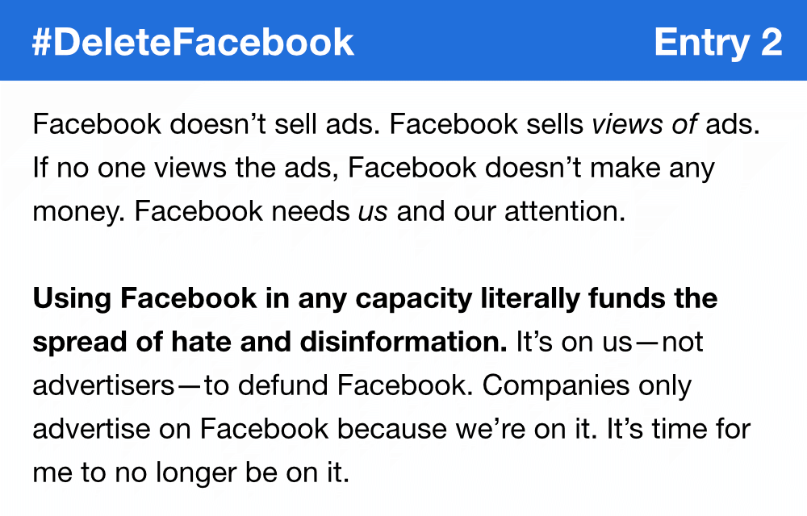
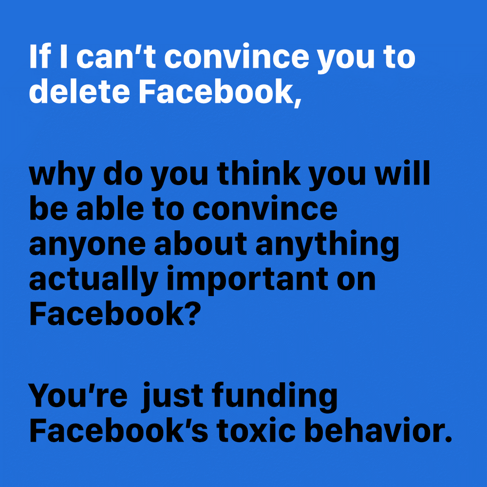

Over the course of August 2020, I shared why I was leaving Facebook on Facebook. My intent was to set a deadline for exchanging contact information and to raise awareness of the harm Facebook inflicts.

While I am unaware of anyone being convinced by my campaign, I hope more people join me in deleting Facebook. You are free to share and remix these images.

I captioned each image post with:

> I’m deleting my Facebook account on September 1, but I’m not unfriending you. Let’s exchange contact info here: <a href="https://www.jeremiahlee.com/posts/delete-facebook/">https://www.jeremiahlee.com/posts/delete-facebook/</a>

Jump to entry: <a href="#entry-1">1</a>, <a href="#entry-2">2</a>, <a href="#entry-3">3</a>, <a href="#entry-4">4</a>, <a href="#entry-5">5</a>, <a href="#entry-6">6</a>, <a href="#entry-7">7</a>, <a href="#entry-8">8</a>, <a href="#entry-9">9</a>, <a href="#entry-10">10</a>, <a href="#entry-11">11</a>, <a href="#entry-12">12</a>, <a href="#entry-13">13</a>, <a href="#entry-14">14</a>

<a href="http://web.stanford.edu/~gentzkow/research/facebook.pdf">Source</a>

<a href="https://www.psychologytoday.com/us/blog/sex-murder-and-the-meaning-life/201404/7-ways-facebook-is-bad-your-mental-health">Source</a>

<a href="https://www.commoncause.org/press-release/groups-deliver-130000-petition-signatures-calling-on-the-ftc-congress-to-investigate-curb-facebook-profiting-from-voter-suppression/">Source</a>

<a href="https://www.commoncause.org/press-release/groups-deliver-130000-petition-signatures-calling-on-the-ftc-congress-to-investigate-curb-facebook-profiting-from-voter-suppression/">Source</a>

<a href="https://www.isdglobal.org/wp-content/uploads/2020/08/Hosting-the-Holohoax.pdf">Source</a>

<a href="https://www.buzzfeednews.com/article/craigsilverman/facebook-zuckerberg-what-if-trump-disputes-election-results">Source</a>

<a href="https://www.wired.com/story/how-facebooks-rise-fueled-chaos-and-confusion-in-myanmar/">Source</a>

<a href="https://www.wsj.com/articles/facebook-hate-speech-india-politics-muslim-hindu-modi-zuckerberg-11597423346">Source</a>

<video class="border border-solid" controls>
<source src="entry-14.mp4" type="video/mp4">

</video>

<a href="https://commons.wikimedia.org/wiki/File:Mark_Zuckerberg_F8_2019_Keynote_(32830578717)_(cropped).jpg">Photo of Mark Zuckerberg</a> &copy; Anthony Quintano. Used under a Creative Commons Attribution 2.0 Generic license.

