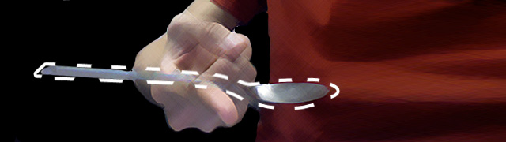

*“Do not try and bend the spoon. That’s impossible. Instead, only try to realize the truth: there is no spoon.” —[The Matrix](https://www.youtube.com/watch?v=uAXtO5dMqEI)*

I have found greater compassion outside of the pews, greater peace through science, and greater urgency to make my life matter by letting go of god.

I have a confession to make. I grew up in a Christian home. I led a Christian club in high school. I taught Sunday School to third graders. I worked at a Christian radio station for five years. I accepted that I was *not* a Christian shortly after I published my <a href="/posts/explicitly-me/">coming out</a> post three years ago.

(The last statement isn't a joke or a trick. I'm not going redefine myself as a person of faith who believes in the teachings of Jesus and just rejects the church by the end of this post. This post will explain my journey to atheism.)

Six years ago, the college group leader at my church in San Diego held a series on the science within Genesis. The series did not discuss "intelligent design", but rather how Genesis could be a metaphor for evolution. This contradicted the teaching of my church in Virginia that Genesis was literal. The discussions prompted me to start validating the faith that I was told to not question if I really wanted to understand it (that's "faith").

Two years later at Emerson, I took two classes on evolution as part of the honors program. Professor Alan Hankin taught Biological Evolution and changed my life is so many ways. My internal struggle of faith became quite an external debate in his class. Alan, a proud atheist, often reminded the class that science is "the study of" everything around us. He lovingly asserted to me in our many conversations that truth wasn't a destination.

I kept reading and learning. I applied critical thinking to everything I believed to be true, validating and invalidating along the way. The more that I read about biology, evolution, and sociology, the more I tried to reconcile my Christian faith with the observations by hundreds of studies in so many fields. After awhile, I could no longer defend Christianity with logic. I was defending Christianity with a desire to believe rather than its own merit. I wanted so desperately to believe my faith was worth believing.

I didn't stop believing in god because of tele-evangalists, gay bashers, the Crusades, the church's many institutional hypocrisies, or President Bush (though these are all valid reasons). I stopped believing in god because I finally recognized the Bible for what it really was.

Humans are narrative creatures. Mythology is useful as a point of reference along a long timeline of existence. The narrative of Christianity is comprised of metaphors to relate the human things we deeply understand, like pain and pleasure, to the things we don't understand, like suffering and death. It can be useful for emotionally healing and morally guiding. I respect religion for this reason. However, metaphors and narrative still separate experience from reality. When the stories replace actuality and critical thinking, it's intellectually dishonest.

My place in this world is no more important than an ant's. I am just a living being, made of stardust, fortunate enough to live in a time when I don't have to mythologize how I got here. I stand on the shoulders of giants, the knowledge accumulated by all humans over hundreds of thousands of years, and get to peak at what's over the wall of not knowing.
