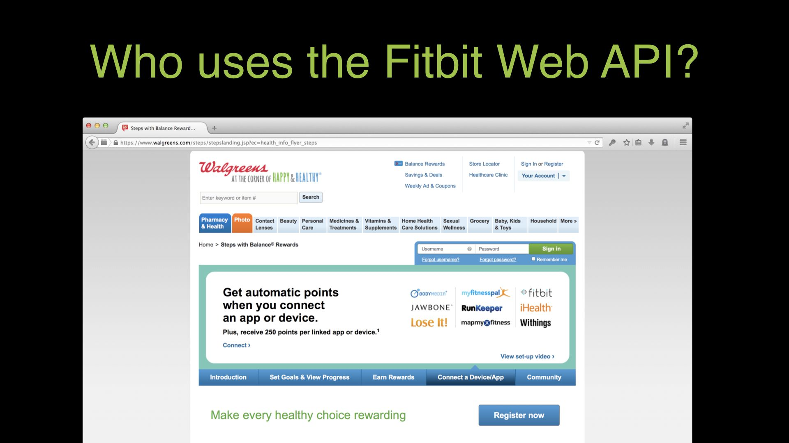

	<h2 id="introduction">Introduction</h2>

	

		
	

	

		
This is an adaptation of my presentation at the <a href="https://apistrat.com/">API Strategy & Practice Conference</a> in Boston, Massachusetts, US on November 3, 2016.

		
This was the afternoon keynote. To shake off the post-lunch lull, I led the audience in a stretch and quick cardio exercise to Christina Aguilera’s <a href="https://open.spotify.com/track/09QPoeQXaoTlBPz75tLIcT"><em>Make The World Move</em></a>.

		
There was <a href="#reactions">high-fiving and yelling, “You’re awesome!”</a> at each other.

	

	

		
	

	

		
Hi, I’m Jeremiah Lee. I live in San Francisco, California and for the last 3.5 years, I have had the best job. I started as the lead engineer and am currently the technical product manager for the Fitbit Web API.

	

	

		
	

	

		
Fitbit is the global leader in activity trackers. We also make a Wi-Fi connected scale and an interactive guided workout product. The company is 9 years old and sells products in 50,000 retail stores in 63 countries.

	

	

		
	

	

		
Fitbit does not think of itself as a consumer electronics company. Fitbit is a personal health and wellness company. We just happen to use technology to achieve that mission. The products are working for a lot of people. At the end of 2015, there were over 29 million active Fitbit users.

	

	

		
	

	

		
Today, being the <em>API Strategy & Practice Conference</em>, I’m excited to share my experience as a practitioner with you. I am also excited to share stats about the Fitbit Web API that have never been shared outside of the company before.

	

	<h2 id="fitbits-web-api-strategy">Fitbit's Web API Strategy</h2>

	

		
	

	

		
Let’s start with strategy. What should we build and for who?

		
Fitbit’s Web API was created in 2010 and released in 2011. I didn’t join the company until 2013. Even though the API was over two years old, I was the first full time engineer dedicated to the Web API and the company had around 150 people at that time. I was asked to figure out what we should do with the Web API.

	

	

		
	

	

		
I thought about this Stephen Covey quote: “Seek first to understand, then to be understood.”

		
Before I could determine a strategy, I needed to understand what had happened in the years before me and why. I needed to understand the business decisions, the product decisions, the current API use cases, and the desired future use cases.

		
I had studied how companies like Twilio and SendGrid built their businesses with their APIs. But it didn’t seem to me that Fitbit should follow the same model because Fitbit’s API was supplementary to its product.

	

	

		<video playsinline muted loop autoplay preload="auto" src="slide-12.mp4" poster="slide-12.jpg" class="contain-video">
			
		</video>
	

	

		
This is <a href="https://web.archive.org/web/20110903220820/http://blog.fitbit.com:80/?p=325">the blog post from 2011 announcing the Fitbit Web API</a>. The thing that stuck out to me is that there was <strong>no defined use case</strong>.

		
I love this part: “What kind of stuff? Well, hard to say, but we’re hoping to see things like visualization tools and logging services and ways to import data from other services into Fitbit.”

	

	

		
	

	

		
How did the Fitbit Web API go from this humble beginning to five years later responding to nearly <strong>4 billion API requests a day</strong> and sending <strong>over 75 million webhook requests a day</strong>?

	

	

		
	

	

		
For starters, Fitbit started using its own API! 7 months after the Fitbit Web API became available, Fitbit released its first mobile app for iPhone.

		
Now Fitbit’s app is available on Android, iOS, Mac OS X, Windows, and of course Web. We don’t have an “API first” mantra, because we design product experiences first. We then design canonical data models that enable those experiences.

		
Our thinking is that we want to share any capability inside of our app with third-party developers if there is an obvious way for the experience to be extended. We have a few exceptions. For example, we don’t allow third-party developers to do user account management or Bluetooth device communication.

	

	

		
	

	

		
Fitbit has another product called <a href="https://healthsolutions.fitbit.com/">Fitbit Group Health</a>. It’s like Fitbit for your workplace. It has over 1,000 enterprise customers. One of the biggest is Target, which offered a Fitbit device to its 300,000 employees. The idea is that a more active workforce is a healthier workforce.

	

	

		
	

	

		
But Fitbit isn’t alone in providing this sort of product.

		
Fitbit works with many other “corporate wellness” providers. The Web API enables Fitbit to be part of these other products and for these companies to sell Fitbit products to customers we couldn’t otherwise have. This has become an important retail channel for the company.

		
<strong>If you want to know if Fitbit makes money via its API, the answer is yes. Lots.</strong>

	

	

		
	

	

		
Over 2.6 million people use a group health product enabled by the Fitbit Web API. That’s a big business opportunity created from an API that launched without much direction.

	

	

		
	

	

		
But that’s not the only thing being built with the Fitbit API. <strong>There are also many companies extending the core product, making Fitbit products more valuable for people.</strong>

		
There are connected apps like <a href="https://blog.fitbit.com/fitbit-x-strava/" title="Good News for Strava Athletes & Fitbit Lovers">Strava</a>. Strava is the top app for cyclists, runners, and triathletes. It’s great to take the data that you record with a Fitbit device and be able to share it to the great community on Strava. Strava is the best app for tracking a few hours of your day. Fitbit is the best for tracking your all day activity.

	

	

		
	

	

		
There are connected apps that provide customer rewards. <a href="https://www.walgreens.com/steps/brhc-loggedout.jsp">Walgreens</a> is a pharmacy. When it started selling Fitbit products, it added a new way to earn discounts through its customer loyalty program. It lets you turn your steps into store credit.

	

	

		
	

	

		
Manual water and food logging are beloved features in the Fitbit app. The <a href="https://www.thermos.com/smartlid">Thermos Smart Lid</a> makes tracking hydration effortless by automatically logging water consumption for you.

	

	

		
	

	

		
The Web API also enables new, additional ways to meaningfully interact with Fitbit. Amazon’s Alexa platform has a <a href="https://help.fitbit.com/articles/en_US/Help_article/2009" title="Can Alexa tell me my Fitbit stats?">Fitbit Skill</a>. You can say things like, “Alexa, ask Fitbit how I slept last night,” and it will reply with information.

	

	

		
	

	

		
The Web API enables researchers to use Fitbit devices in their studies.

		
Fitbit has been used in <a href="https://www.fitabase.com/research-library/" title="Fitbit Research Library by Fitabase">over 100 research studies</a> to date with academic research institutions, such as the Mayo Clinic and Johns Hopkins. Recently, we announced a <a href="https://www.dana-farber.org/newsroom/news-releases/2016/dana-farber-and-fitbit-partner-to-test-if-weight-loss-can-prevent-breast-cancer-recurrence/" title="Dana-Farber and Fitbit partner to test if weight loss can prevent breast cancer recurrence">partnership with the Dana-Farber Cancer Institute</a> to support a study that looks at the impact of physical activity and weight loss on breast cancer recurrence by having study participants track their activity and weight loss to share with health coaches using Fitbit activity trackers, Aria Wi-Fi Smart Scale, and a subscription to FitStar workouts.

		
One of the products best enabling researchers to take advantage of Fitbit is a company called <a href="https://www.fitabase.com/">Fitabase</a>. Researchers generally aren't great programmers, so Fitabase helps them get data from the Fitbit API easily. Many of these studies have hundreds or thousands of participants over years and the API enables not only pulling the data in aggregate, but helping with participant compliance throughout the study by reporting if people are charging and syncing their devices.

	

	

		
	

	

		
There are over 10,000 apps <a href="https://dev.fitbit.com/" title="Fitbit developer portal">registered</a> to use the Fitbit Web API today that have at least 1 user. <strong>There is a long tail of enthusiastic customers with some programming skill wanting to play with their data.</strong>

	

	

		
	

	

		
And we love that. That’s why we created an <a href="https://ifttt.com/fitbit"><abbr title="If This Then That">IFTTT</abbr> channel</a>: to allow anyone, even people who don’t know how to program, to take advantage of the Web API. It lets people use APIs by completing a simple sentence. For example: if there is a new daily activity summary, then automatically log it to a Google Sheet.

	

	

		
	

	

		
So that’s how the API is being used. <strong>What’s the strategy?</strong>

		<ul>
			<li>Support our own apps</li>
			<li>Support apps that enable us to sell more products</li>
			<li>Support apps that enhance our product experience</li>
			<li>Support apps that validate our product</li>
			<li>Support data portability for and creativity of individuals</li>
		</ul>
		
Do you see what’s missing? <strong>Fitbit is <em>not</em> selling your personal data</strong>, because we believe that people own their data.

		
And <strong>Fitbit is not sponsoring hackathons because hackathons don’t deliver meaningful value to our business</strong>. Instead of sponsoring hackathons and hoping for the best, we are much more strategic about finding meaningful integrations the increase value for Fitbit, the partner, and—most importantly—our shared customers.

	

	

		
	

	

		
It’s a strategy that seems to be working. 1 in 7 Fitbit users has connected a third-party app.

	

	

		
	

	

		
<strong>Third-party apps are meaningful to Fitbit as a business and its customers.</strong>

		
A few years ago, <a href="https://gigaom.com/2014/11/14/netflix-is-shutting-down-its-public-api-today/" title="Netflix is shutting down its public API today">Netflix killed off its public API</a> with the justification that it only represented .3% of its API traffic. And many analysts proclaimed that Netflix thought third-party ecosystems were useless.

		
But when I look at the same data that Netflix presented to justify its conclusion, I reached a very different conclusion. It’s not that third-party ecosystems are valueless. It’s that Netflix’s API didn’t have enough value to sustain a third-party ecosystem.

		
I’ve learned at Fitbit that <strong>when you share the value of your primary product and foster the community, there can be incredible experiential and monetary value created</strong>.

	

	<h2 id="scaling-api-practices">Scaling API Practices</h2>
	<h3 id="internal-api-practices">Internal API Practices</h3>

	

		
	

	

		
So that’s a little about our Web API strategy. Now let’s talk about what it takes to build and use the API at scale. This is a bit of MTIV, <em>making the invisible visible</em>.

		
Over the last 3 years, the number of Fitbit Web API requests has increased over 10×. It’s extraordinary growth.

		
I think the bigger challenge than the technology involved in scaling the Fitbit Web API has been figuring out the right processes and people. I mentioned that when I was hired, I was the first and only person on the API team. We’ve now hired a bunch of great people. We’re over 1,000 employees now.

	

	

		
	

	

		
My team calls itself the API-rates. We are team responsible for core API infrastructure.

		
We support the Web API engineers throughout the company.

	

	

		
	

	

		
Fitbit structures its product and engineering teams in two ways. The first way is called a “feature team”. It has a product manager, a designer, a lead engineer, backend engineers, and a QA engineer. It also has an Android, iOS, Web, and Windows client engineers. We call this a “full stack team”.

		
An example of this would be our sleep tracking team. The team has all of the skills necessary to create the sleep tracking feature on every app platform. We have many feature teams.

		
I like this approach. It means that every API we change or create is immediately vetted by 5 of the largest users of the Fitbit Web API.

		
But eventually, all of the feature teams have to release a binary to the app stores. So another type of team is a “component team”. These teams work with all of their type of engineers across all the feature teams.

		
The iOS component team makes sure that all the feature teams’ work is together to create a release. Similarly, with backend engineers, the API Infrastructure <em>component team</em> builds things that are needed by all API feature teams, such as OAuth, rate limiting, client management, and testing frameworks.

	

	

		
	

	

		
<strong>My primary strategy for coordinating Web APIs across the company has been: make it easy to create the right thing.</strong>

		
Something is easy if it is obvious. Something feels obvious when it comes from intuition. And intuition comes from empathy.

		
I’ve tried to establish lightweight processes internally to help build that empathy. I think Fitbit’s team structure is conducive to that, but we’ve needed to do more to create historical understanding.

		
I started with a basic thing: documenting the design style of the Fitbit Web API so that all of the endpoints feel similar regardless of which feature team made them.

		
Engineers used to get Jira tickets to modify an endpoint and just do whatever they thought. We’re starting to change this so that developers modify the <a href="https://www.openapis.org/">OpenAPI Specification document</a> for the endpoint and submit a pull request for review to my team and the client teams. This slows the process down a bit, but allows people to provide feedback when it’s useful. Feedback isn’t useful after the change has been implemented.

	

	

		
	

	

		
<strong>We’re also using process to make it harder to break things.</strong>

		
I hang the Linus Torvalds quote in my team’s workspace: “We don’t break userspace.” <strong>When you’re the API, it’s more important to be correct than quick in a release.</strong>

		
The API Infrastructure team has been working on tools and testing for this. Going back to our use of OpenAPI Specification documents, we’re working on a way to use them for integration testing, so that no unintentional API changes get out.

		
We’ve had a few well-intentioned engineers refactor code, especially as part of splitting services out of our monolith, and in the process unintentionally change a property name or response value type. When those sort of changes get to production, they break many apps and it’s tough, so we’re trying to figure out ways to prevent that from happening. I think our “guardrail” process can do that and also result in better designed APIs.

	

	

		
	

	

		
A big thing is just being on the lookout for patterns. <strong>If two people fail at something, fix the system so a third person doesn’t.</strong>

		
If multiple people are struggling with a concept, we have enough evidence that something could be better in the documentation or the API design.

		
My team holds retrospectives when things go wrong. We also hold them when things go well. But when things go wrong, we try to determine how the problem could have been prevented and if the problem is likely to happen again. We try to not add process unless it’s going to be beneficial, so when we do suggest changes, the motivations are typically well understood.

	

	

		
	

	

		
One recurring sentiment that I’ve had to address is one where backend engineers argue for a suboptimal API design because it’s easier for them. And I’ve had to tell them: <strong>I don’t care if you think it’s hard to create an API if it’s easy for the client to use. Hard things should be hard once—for the API provider—instead of hard many times for every client that uses it.</strong>

		
Sometimes a great API design is not going to be the most efficient thing on the backend. Sometimes tech debt is a problem. I get it. But API developers’ jobs is to make the clients’ jobs easier. That’s their KPI.

		
We <em>collectively</em> ultimately save ourselves time and reduce errors when we do hard things once.

	

	

		
	

	

		
Another way we consult with feature teams is by having open office hours regularly. Sometimes no one shows up, but it’s typically filled with at least a couple meaningful conversations that might not have otherwise happened.

		
It’s closely related to a strategy we take with third-party developers.

	

	<h3 id="scaling-third-party-api-practices">Scaling Third-Party API Practices</h3>

	

		
	

	

		
As I mentioned earlier, Fitbit is highly intentional about its API strategy. When we find a partner we want to work with, we want to do everything we can to make that integration successful.

	

	

		
	

	

		
And we do that by understanding the software development lifecycle. I break it down into 3 phases: planning, active development, and maintenance. My team works with partners in all three.
		
Before a line of code is written, we schedule a meeting with the relevant engineers. We learn about their product and tell them about ours. Often the engineers doing the integration are just being told to do the work and haven’t ever used Fitbit. So we want to make sure everyone understands how the products align.

		
My team creates an integration guide that has the steps for the integration, the endpoints with deep links to our standard API documentation, and a long list of potential gotchas. The partner goes off and does their development. They can contact my team for help if needed and the actual engineers on my team provide them support.

		
We often assist with end-to-end testing before it goes live. Then when an integration goes live, we monitor the request volume and error rates for the integration so that we can be proactive in detecting problems.

		
We also work closely with the customer support teams at both companies. Nothing is worse for a shared customer than getting a run around when there’s a problem. Fitbit has support information for customers and its customer service reps on diagnosing issues and how to direct people to get support from the partner effectively.

		
All of this is so that an integration can go into a functioning maintenance mode where nothing bad ever happens and nothing ever changes. Right?

	

	<h4 id="change-management">Change Management</h4>

	

		
	

	

		
But change happens. Fitbit’s core product evolves and sometimes that means breaking changes happen. Deeply understanding how apps use the Fitbit Web API helps us evaluate the impact of a given change. We typically can provide 30–90 days notice of a breaking change to apps.

	

	

		
	

	

		
Let’s talk about the biggest change I’ve overseen at Fitbit: the transition from OAuth 1.0a to OAuth 2.0. It affected the entire ecosystem.

		
Fitbit has custom, in-house built API management. We created an OAuth 2.0 implementation and dogfooded it with our computer syncing software, Fitbit Connect, in Fall 2014—going on for two years.

		
We continued development and eventually had a public beta ready in May 2015. We announced that our intent was to remove OAuth 1.0a and that we’d really appreciate if apps could test our OAuth 2.0 and provide feedback. To encourage this, we offered a few carrots in the carrots-and-sticks sense.

		
In order to get access to the new heartrate and GPS location data from Fitbit’s new devices, apps would have to upgrade to OAuth 2.0 and request permission for them using the ‘scope’ feature. Because this was a much sought after feature, it successfully motivated developers.

		
We received much feedback, a few bug reports, and made a few breaking changes. In October 2015—last year—we made OAuth 2 the official recommendation, deprecated OAuth 1.0a, and announced a removal date in six months.

		
We also announced that in five months, we were going to do a 1 hour blackout test where we would reject OAuth 1.0a traffic. So apps needed to be ready by this time. They could then use this test to confirm they didn’t have any remaining OAuth 1.0a requests and even if they did, it’d only be broken for 1 hour.

		
We sent many emails to developers about this. A week before the blackout test, we found all of the apps still using OAuth 1.0a and sent them an additional email warning their app would break. And after the blackout test, we sent all of the apps that broke an email that we noticed they broke and Hey! We’re here to help you.

		
April came and too many apps were close, but not yet ready, so instead of cutting off OAuth 1.0a access for them, we stopped any new apps from being able to use it. And on August 1st, we turned off OAuth 1.0a.

		
Here we are 2 years later—Over 10k apps made the transition, including all of the partner apps, so I’m quite proud of this transition.

	

	<h2 id="conclusions">Conclusion</h2>

	

		
	

	

		
Again, scaling an API is much more than just adding servers. You have to think about what it means to have many people creating and using the APIs. Make it easy to do the right thing. Make it hard to break anything. Act as servant leader coaches as much as possible.

		
So there you go. I hope today that you found some benefit from hearing my story at Fitbit.

	

	<h3 id="ethical-practices">Ethical Practices</h3>

	

		
	

	

		
This final thought is coming from me, as Jeremiah, not from my employer.

		
As developers, we have incredible power to create. I am troubled that too many developers are not using it responsibly.

		
I graduated from <a href="https://www.emerson.edu/">Emerson College</a>, just a few blocks from here, with a media arts degree. I am grateful part of my education included ethics and history of how media was a powerful tool for both good and bad. I am disappointed traditional <abbr title="computer science">CS</abbr> degree programs do not seem to be requiring similar studies. There is more to programming than data structures and algorithms. Media is created with intent to communicate a message to an audience. But we can create software without critically examining the intent for creation. Focusing on the technical details to fulfill requirements is so easy and common that consideration of how software can be exploited is a specialization in itself as security engineering.

		
Many of the things we learned from the <a href="https://www.pri.org/stories/2013-07-09/17-disturbing-things-snowden-has-taught-us-so-far" title="17 disturbing things Snowden has taught us (so far)">Snowden leaks</a> are examples of capabilities that could not have been created without intent. If your employer comes to you and asks you to build a security backdoor that would undermine the civil liberties of your customers, the correct answer is “no”.

		
I understand that could be an easy ethical, but not financial, answer to give. But it’s the right one. There are lots of companies where you don’t have to make that compromise.

		
I’m thankful that I work at a company committed to protecting people’s data and for not engaging in corporate surveillance business models like some of the biggest tech companies today.

		
Principles matter and I hope there is an increased discussion about this in 2017. And API Strat is a great place for it to happen.

		
Thank you for your time. It’s been an honor to hold your attention.

	

	<h1 id="image-credits">Image credits</h1>
	<ul>
		<li><a href="https://unsplash.com/photos/SHP1t8EduMY">“Golden Gate Bridge”</a> by Umer Sayyam</li>
		<li><a href="https://investor.fitbit.com/press/press-kit/default.aspx">Fitbit lifestyle product images</a> from Fitbit press kit</li>
		<li><a href="https://www.marvel.com/comics/issue/16926/amazing_fantasy_1962_15">“Amazing Fantasy #15: Spider-Man!” (1962)</a> by Stan Lee, Steve Ditko, Marvel</li>
	</ul>
	<h1 id="reactions">Reactions</h1>
	<blockquote class="twitter-tweet" data-lang="en">
Started his talk with dancing, shared a lot of data and ended with ethics. Best talk format. <a href="https://twitter.com/JeremiahLee?ref_src=twsrc%5Etfw">@JeremiahLee</a> <a href="https://twitter.com/hashtag/APIStrat?src=hash&amp;ref_src=twsrc%5Etfw">#APIStrat</a>
&mdash; Kristen Womack 📚 (@kristen_womack) <a href="https://twitter.com/kristen_womack/status/794292871092436992?ref_src=twsrc%5Etfw">November 3, 2016</a></blockquote>
	<blockquote class="twitter-tweet" data-lang="en">
At <a href="https://twitter.com/hashtag/APIStrat?src=hash&amp;ref_src=twsrc%5Etfw">#APIStrat</a> <a href="https://twitter.com/JeremiahLee?ref_src=twsrc%5Etfw">@JeremiahLee</a> getting the crowd on their feet <a href="https://t.co/wsbsnQ6yEo">pic.twitter.com/wsbsnQ6yEo</a>
&mdash; Mark O&#39;Neill (@TheMarkONeill) <a href="https://twitter.com/TheMarkONeill/status/794285285727240192?ref_src=twsrc%5Etfw">November 3, 2016</a></blockquote>
	<blockquote class="twitter-tweet" data-lang="en">
You can clearly see that <a href="https://twitter.com/JeremiahLee?ref_src=twsrc%5Etfw">@JeremiahLee</a> is working for an activity tracker company <a href="https://twitter.com/fitbit?ref_src=twsrc%5Etfw">@fitbit</a> when he makes the whole <a href="https://twitter.com/hashtag/APIStrat?src=hash&amp;ref_src=twsrc%5Etfw">#APIStrat</a> move/dance/yell
&mdash; Nicolas Grenié (@picsoung) <a href="https://twitter.com/picsoung/status/794285751647223812?ref_src=twsrc%5Etfw">November 3, 2016</a></blockquote>
	<blockquote class="twitter-tweet" data-lang="en">
Awesome introduction by <a href="https://twitter.com/JeremiahLee?ref_src=twsrc%5Etfw">@jeremiahlee</a> who refuel the whole room with positive energy by making us moving,screaming &amp; laughing <a href="https://twitter.com/hashtag/MTWM?src=hash&amp;ref_src=twsrc%5Etfw">#MTWM</a> <a href="https://twitter.com/hashtag/APIStrat?src=hash&amp;ref_src=twsrc%5Etfw">#APIStrat</a>
&mdash; API Handyman (@apihandyman) <a href="https://twitter.com/apihandyman/status/794285683452035072?ref_src=twsrc%5Etfw">November 3, 2016</a></blockquote>
	<blockquote class="twitter-tweet" data-lang="en">
<a href="https://twitter.com/FitbitSupport?ref_src=twsrc%5Etfw">@FitbitSupport</a> So, <a href="https://twitter.com/JeremiahLee?ref_src=twsrc%5Etfw">@JeremiahLee</a> is giving a talk at <a href="https://twitter.com/hashtag/apistrat?src=hash&amp;ref_src=twsrc%5Etfw">#apistrat</a>. Began by getting us moving. Has a Fitbit thermos. Great brand rep! Keep him.
&mdash; 🐝 Lyre Calliope 🐙 (@CaptainCalliope) <a href="https://twitter.com/CaptainCalliope/status/794286865071411200?ref_src=twsrc%5Etfw">November 3, 2016</a></blockquote>

