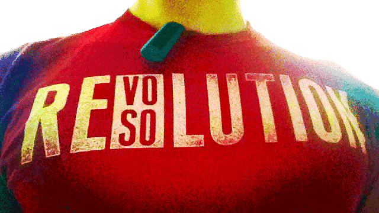

I’m elated to announce that I will be joining [Fitbit](https://www.fitbit.com/) as its full time API engineer next week. I’ve never been more excited about a job. Not only does Fitbit make an incredible product that I love,<a href="#footnote-1">1</a> but they created a role specifically for me.

My [CV](https://www.linkedin.com/in/jeremiah-x-lee/) confuses some people. Software engineering without a computer science degree. Director of product after being an engineer. Graphic design awards? Articles, conference talks, and tweets about UX?? I have a good narrative to weave these together once I’m in an interview, but I&#8217;ve recently learned that every detail I had to explain on my CV worked against me when trying to get that first interview.<a href="#footnote-2">2</a>

Fitbit _could_ have just offered me the front-end software engineer position that I applied for. Instead, they researched me and explored my passion for web service API design and developer experience. This speaks highly of their hiring process and the team leadership.

I could not have crafted a more perfect next step in my career. I’m going to be able to continue my work in the user (developer) experience field and engineer a portion of a market leading product line.

I was already a huge fan of Fitbit and its mission to help improve people’s health. The Fitbit API has been around longer than all the devices currently available for sale—well before APIs were cool.<a href="#footnote-3">3</a> Fitbit values its third-party developers and is making further investments for them.

I look forward to learning from and contributing to Fitbit's continued design and technical excellence.

(And you should totally get a [Fitbit](https://www.fitbit.com/?ref=JeremiahLee) and send a [friend](https://www.fitbit.com/user/23RJ9B) request.)

* * *

  1: I bought my first Fitbit last September after <a href="http://jeremie.com/?ref=JeremiahLee">Jeremie Miller</a> (the guy who created <a href="http://xmpp.org/">XMPP</a> and co-founded <a href="https://singly.com/">Singly</a>) rekindled my excitement about the quantified self. I bought my second Fitbit shortly thereafter when the <a href="https://www.amazon.com/gp/product/B0095PZHPE/ref=as_li_qf_sp_asin_il_tl?ie=UTF8&#038;camp=1789&#038;creative=9325&#038;creativeASIN=B0095PZHPE&#038;linkCode=as2&#038;tag=jeremiahlee-20">Fitbit One</a> with vibration alarm was announced. This really is a killer feature. The Fitbit One is one of my favorite products.

  2: I don’t put two other businesses I co-founded (Mighty Mac Hosting and Grey Matters Media) on my CV because they don’t fit the professional narrative I need to tell in order to convince people that I’m awesome for a specific job.

  3: <a href="https://blog.fitbit.com/?p=325">Fitbit Blog: The Fitbit Public API has arrived</a>

