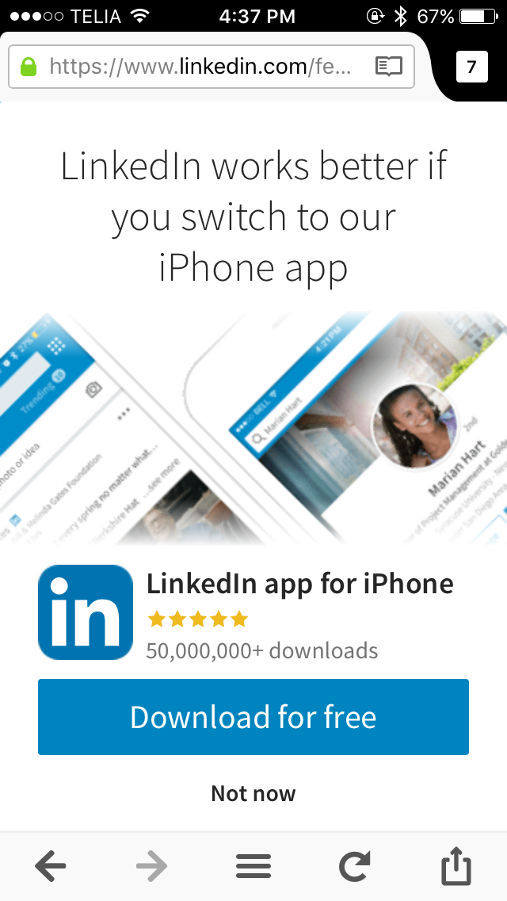
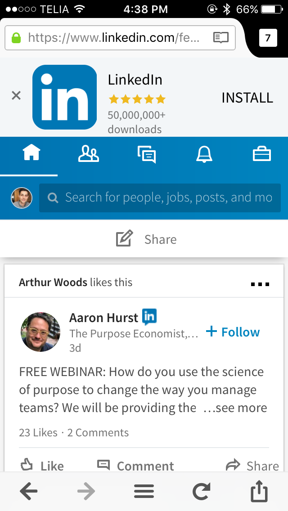
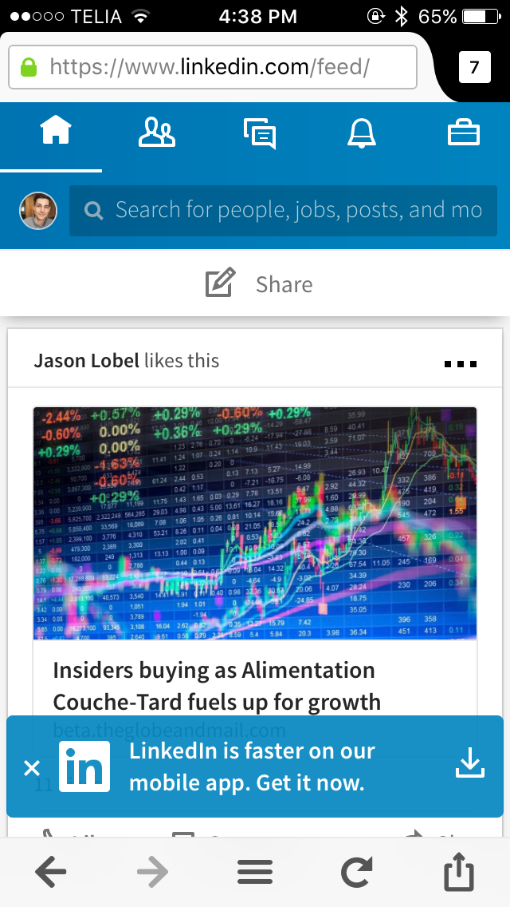

Since starting and finishing my most recent job search, something unexpected happened: I kept using LinkedIn. Sometime in the last four years, LinkedIn became a place people shared interesting content and LinkedIn curated the most interesting newsfeed of all the social networks that I give my attention. That’s pretty cool.

I admit that I am in the minority of iPhone users. I don’t like having apps installed. Apps send unwanted notifications. Apps run in the background, [wasting precious electrons](https://www.macworld.com/article/3020539/apple-phone/4-ways-to-take-charge-of-ioss-background-app-refresh-feature.html "4 ways to take charge of iOS's Background App Refresh feature") from my battery and [tracking data](http://mashable.com/2017/06/07/ios11/ "iOS 11 will finally put a stop to apps tracking you when you're not using them") I don’t want to share. [Apps take up much storage space](https://sensortower.com/blog/ios-app-size-growth "The Size of iPhone’s Top Apps Has Increased by 1,000% in Four Years") that Apple still overcharges for. I use Twitter, Facebook, and LinkedIn multiple times a day primarily on my iPhone, but I don’t use their iOS apps. I access them via a [Web browser on my iPhone](https://mozilla.org/firefox/ios "Firefox for iOS").

Facebook’s and Twitter’s mobile Web apps are fantastic. So is LinkedIn’s. But unlike Facebook and Twitter, LinkedIn seems to dislike how great its mobile Web app is. This was my experience using LinkedIn’s mobile Web app today:

    

    

    

1. I went to [LinkedIn.com](https://www.linkedin.com/). **A full screen modal window appeared.** It proclaimed that LinkedIn “works better” in its iPhone app. The proclamation was not accompanied by evidence of *how* the iOS app works better. I don’t trust random modals on the Internet, so I tapped “Not now”.

2. The LinkedIn experience I was expecting was then revealed. **However, a banner to install LinkedIn’s iOS app was above the app header UI.** Having not changed my mind in the last 2 seconds, I tapped the ‘x’ to dismiss the banner. (Worth noting that the banner is an imitation of [iOS’s “smart app banners”](https://developer.apple.com/library/content/documentation/AppleApplications/Reference/SafariWebContent/PromotingAppswithAppBanners/PromotingAppswithAppBanners.html)—and [the app has a 3.5—not 5—star rating](2017-09-17-linkedin-4.png "Apple App Store screenshot at time of publishing") as claimed!)

3. I then proceeded to finally enjoy the newsfeed that I came to the app for. However, after 2 more seconds, **a sticky banner appeared on the bottom of the screen**. It told me “LinkedIn is faster” in its iOS app. Speed isn’t a problem I’ve ever had on LinkedIn, but at least the value statement is better than “works better”. For the third time within 15 seconds, I tapped UI to reject an unwelcome distraction.

Hey LinkedIn, “no” means “no”. There is nothing you can do to make me want to install your iOS app. Even if I didn’t dislike native apps in general, your value propositions were weak. If you decide to stop supporting mobile Web browsers, I will just use your product less. It’s valuable, but it’s not *that* valuable to me. When [Facebook started blocking access to Messenger in mobile Safari](https://techcrunch.com/2016/06/03/facebook-is-disabling-messaging-in-its-mobile-web-app-to-push-people-to-messenger/ "Facebook is disabling messaging in its mobile web app to push people to Messenger"), I mostly stopped using Facebook for private messages.

LinkedIn, I like you, but I need you to stop 💩ing on your awesome Web app. I am making an active decision to use your product on the platform I prefer. I need you to respect my choice.
