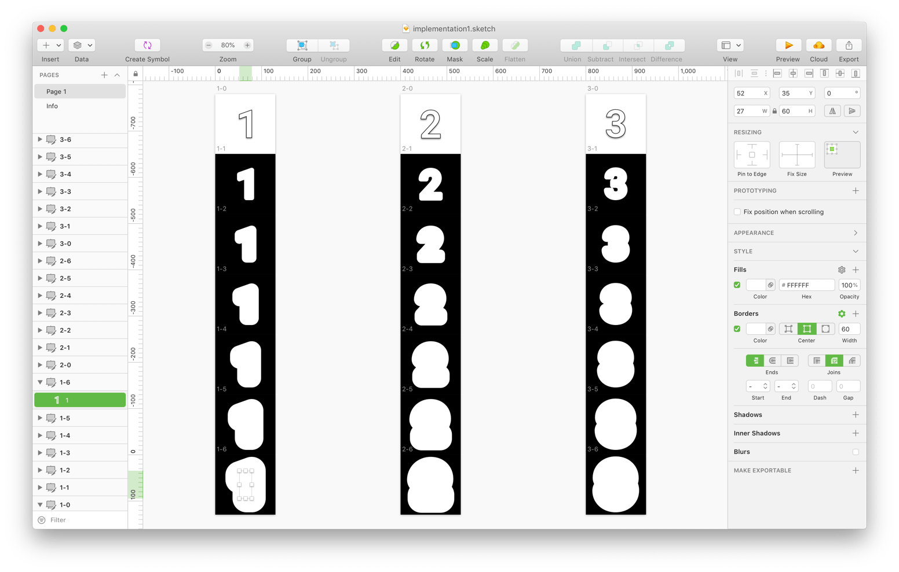
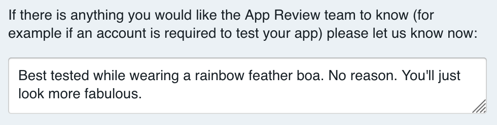

I released my first watchface for FitbitOS in 2018. It was called _[Pride Flags](https://gallery.fitbit.com/details/a8195bb6-649a-45be-8f0c-9ca68af7c130)_<a href="#1">1</a> and displayed the time and stats with various queer community flags. I was not planning to create another LGBT+ Pride-related watchface until I had an idea while running in a Barry's Bootcamp class in late May.<a href="#2">2</a> I could not stop thinking about the design once it came to me. I just _had_ to make it and get it out for Pride Month (June).

[_Rainbow Ripple_](https://gallery.fitbit.com/details/e9f93783-42d4-4e7d-ba57-9a2cfce9ebc7) is a numeric watchface. The time is displayed with 6 borders wrapping the numbers. The borders cycle thru the colors of the rainbow<a href="#3">3</a>. Small fast-fading squares of digital confetti appear randomly across the screen.

Here are 6 lessons I learned creating both watchfaces.

<video autoplay="true" muted="true" loop="true" width="300" height="300">
<source src="rainbow-ripple-av1.webm" type="video/webm">
<source src="rainbow-ripple-h264.mp4" type="video/mp4">
Your browser does not support HTML5 video in WebM with AV1 or MP4 with H.264.
</video>

## Lesson 1:  Raster Rules or Bitmap is Best

FitbitOS uses SVG and CSS for implementing UI and TypeScript / JavaScript for application logic. I assumed I would have access to everything I was accustomed to using in a Web browser. That was a reasonable, but tragically incorrect, assumption. FitbitOS has minimum viable subset of CSS and SVG features for drawing on the screen. This led to many wasted hours and frustration.

Here is a better way to think about FitbitOS’s use of CSS and SVG. SVG is a document canvas for positioning bitmap graphics and text. Forget about vector graphics. CSS merely is a way to be less repetitive in declaring style attributes on multiple SVG elements. Animation is done using SVG SMIL animation—not CSS animation.

Imagine it is 2001 and you are developing for Internet Explorer 6. That’s about how useful CSS is in FitbitOS. The lack of utility is why I do not use CSS for much when developing for FitbitOS. For example, dynamically changing the class name on a SVG element will not update that element’s appearance. We have to change the element’s properties directly, as if they were inline styles, once they are rendered initially.

SVG in FitbitOS has a similarly small portion of its specification implemented. Document features like `node.children` are not implemented. A curve is the most advanced thing we draw with it. I was flabbergasted to not find support for paths. **If it’s not text, do it in pixels.**

The design of _Rainbow Ripple_ can be implemented multiple ways using CSS and SVG features found in Web browsers. I tried several approaches that were not viable in FitbitOS due to its limited implementations of CSS and SVG. I was about to give up on this design until I learned about the ability to [dynamically color fill grayscale images](https://dev.fitbit.com/build/guides/user-interface/css/#image-grayscale-magic-).

I figured I could make 7 images for every number in the time display. Each image would be one stroke around the number. When the images were stacked on top of each other, I could dynamically color each image. This approach worked, but it required tediously creating 77 images.

<video autoplay="true" muted="true" loop="true" width="320" height="320">
<source src="rainbow-ripple-grayscale-image-technique.webm" type="video/webm">
<source src="rainbow-ripple-grayscale-image-technique.mp4" type="video/mp4">
Your browser does not support HTML5 video in WebM with AV1 or MP4 with H.264.
</video>

Here is what the Sketch<a href="#4">4</a> file looked like. Each layer is in a separate artboard because Sketch does not have a way to export a layer the size of the artboard. Sketch exports the smallest dimension of the layer possible, which is reasonable when not having to precisely position 7 images on top of each other.

## Lesson 2:  Only compute when the display is on

The party doesn’t stop just because the display is off. Watchface creators need to listen for `display` `change` events. I incorrectly assumed a watchface’s execution was paused and resumed by FitbitOS. I only learned this was not true when I saw `console.log` messages continue when the display was off. This _really_ should be more prominently noted in the documentation. I suspect many of the complaints from users about certain watchfaces draining their device batteries are due to watchface creators overlooking this detail.

There are two primary animations in _Rainbow Ripple_: the color cycling of the time and the “digital confetti”. Both are controlled by `setTimeout` loops. Upon watchface initialization and the display turning on, the function that changes the colors on each character’s 7 layers is called. The function then sets a timeout to call itself again in 100ms. The timeout is always cleared before being set to prevent multiple timeouts from existing.

I used `setTimeout` instead of `setInterval` because I saw animation frame skipping occasionally. A `setTimeout` loop creates a guarantee that the computation of the drawing is completed before the next animation frame is requested. If an app running in the background causes the device to not be able to render the animation fast enough, I prefer the animation to slow down rather than drop animation frames in this case.

The confetti animation uses a 50ms timeout loop that moves 1 of 12 squares to random `x`, `y` coordinates on the screen and then triggering an `enable` event that causes a SVG SMIL opacity animation.

When the watch display is not on, calculating these animations is pointless. Listening for the `display` `change` events allowed me to clear the timeout loop and save people’s batteries.

## Lesson 3:  Store app settings twice

This hole in the developer experience is so big that I could throw a Fitbit Aria 2 scale thru it. It’s an excellent example of APIs that are functional but independently incomplete. I will describe how it works and then how Fitbit should improve it.

A watchface on FitbitOS is actually two apps: one that runs on the smartwatch and a “companion” app that runs inside of the Fitbit app on your phone/tablet/computer. Watchface settings are accessed by the user in the companion app, which just looks like a settings screen for a watchface to the user. Fitbit did a good job here making third-party companion apps seem natively part of its app.

<video autoplay="true" muted="true" loop="true" width="295" height="640">
<source src="fitbitos-watchface-settings.mp4" type="video/mp4">
Your browser does not support HTML5 video in MP4 with H.264.
</video>

In order for the watchface to know when its settings are changed via the companion app, the watchface must establish a socket connection to the companion app and listen for `message` events. The settings data in the companion app is automatically saved. However, the settings data is *not* automatically saved on the watch. If the watchface is restarted because another app needed the memory or the device was restarted, it will not have access to its settings until the companion app sends the data again. This is a suboptimal end user experience because the watchface comes back in a state the user does not expect, at least for a moment.

Fitbit did create a way out of this situation. FitbitOS provides a way for smartwatch creators to store data on the device. We have to store the settings data as it comes in from the `message` events and we have to read the data from the device before listening for new settings data. **While functional, this is a suboptimal developer experience because every smartwatch creator has to implement the same boilerplate code to achieve basic functionality.**

I think it’s great that watchfaces can store arbitrary data on the device. I think it’s great that settings data is stored in the companion app automatically. But FitbitOS developers should not need to coordinate settings storage across two apps. The smartwatch app should have an API (built on top of the current APIs) for setting, reading, and being notified of changes to settings without having to deal with sockets and file systems.

## Lesson 4:  Use the CLI

In the year between creating my first and second watchfaces, Fitbit introduced the <a href="https://dev.fitbit.com/build/guides/command-line-interface/?ref=JeremiahLee">FitbitOS <abbr title="command line interface">CLI</abbr></a>. The CLI allows us to create watchfaces using the development tools we prefer to work with instead of the browser-based [Fitbit Studio](https://studio.fitbit.com/) <abbr title="Integrated Development Environment">IDE</abbr>. I prefer to use Microsoft Visual Studio Code as my code editor. Its TypeScript tooling particularly is excellent. Having the files locally means I can use Git for source control.

The CLI also introduced a <a href="https://community.fitbit.com/t5/SDK-Development/How-to-use-repl-device/m-p/3222375"><abbr title="Read Eval Print Loop">REPL</abbr></a>. The REPL saved me a significant amount of time by allowing me to pixel fuck<a href="#5">5</a> in the FitbitOS Simulator instead of having to compile and reload to test every placement change.

Fitbit sends mixed signals to developers new to its smartwatch platform. We can use Fitbit Studio or the FitbitOS CLI. We can use JavaScript or TypeScript. Different tutorials use different setups. Few of the examples are in TypeScript. The CLI is better documented in the forum than in the developer documentation. Fitbit should focus on one golden path for developers. I think it should focus solely on improving its CLI with TypeScript boilerplate templates.

## Lesson 5:  Use the support forum

[Fitbit’s SDK Development community forum](https://community.fitbit.com/t5/SDK-Development/bd-p/sdk) has been the best place to get support when I have gotten stuck. Many times, my question has already been asked and answered by someone else. Fitbit employees often answer questions here.

## Lesson 6:  Make formal feature requests

The best job I have ever had was 4 years at Fitbit. I felt satisfied when I left, but I still often wonder about how much more I could have accomplished if still there. The current developer experience of FitbitOS is a mix of cursing in frustration and awe when things actually work. I wish I still had influence internally to improve the situation. But here I am, no longer on the inside and with ideas relentlessly nagging me to come into existence.

So what do I do?

I write the user stories for the product manager. I share my use case to help provide context. I explain what opportunity is created by doing it. I provide the product manager justifications for prioritizing my request over the many other requests. I remember their humanity. I assume they are smart, capable, and doing the best job they can given many constraints I cannot know.

I haven’t done this for every feature request below, but I hope to get around to it because I believe Fitbit still makes the best fitness wearables and I want it to become the best in smartwatches.

### My feature requests

- [Add 24 hour time setting to Fitbit mobile apps](https://community.fitbit.com/t5/Feature-Suggestions/24-hour-clock-format-as-option-in-app/idc-p/3542651#M214520)
- [Add ability to change `className` on element](https://community.fitbit.com/t5/SDK-Development/Change-class-of-an-element-with-JS/m-p/3170236)
- [Add ability to get child nodes using `node.children`](https://community.fitbit.com/t5/SDK-Development/Get-child-of-DOM-element/m-p/3374037)
- [Add ability to access user’s main goal setting](https://community.fitbit.com/t5/SDK-Development/How-do-I-access-main-goal-setting/m-p/3501319)
- [Add ability to access hourly steps progress (“reminders to move”)](https://community.fitbit.com/t5/Feature-Suggestions/Add-hourly-step-count-to-SDK-so-customers-can-see-it-on-clock-faces/idi-p/2647902)
- Add ability to change the time and date in FitbitOS Simulator in order to test date strings
- Add ability to see CPU, memory, and power utilization of an app/watchface in FitbitOS Simulator
- Add ability to export video of screen in FitbitOS Simulator
- Add ability to hide the device outline in FitbitOS Simulator
- Add ability to change color behind device or specify background image in FitbitOS Simulator
- License example code as [CC0 1.0 Universal (CC0 1.0) Public Domain Dedication](https://creativecommons.org/publicdomain/zero/1.0/) so creators do not have to cite the copyright of documentation examples when used

1: It was originally named “Pride” but I renamed it because other creators later released watchfaces also named Pride.

2: My best ideas often come while running. I actually had two ideas, but the other one will have to wait until 2020.

3: I used the 6 color variation, but Gilbert Baker’s original Pride flag in 1978 had 8 colors. He updated in 2017 with a 9th color, lavender, to represent diversity. I want to update _Rainbow Ripple_ to use the 9 color variation. [“Our Enduring LGBTQ Symbols”, San Francisco Bay Times](http://sfbaytimes.com/our-enduring-lgbtq-symbols/)

4: I started this design in InVision Studio, but had to complete it in Sketch because InVision Studio did not have the ability to convert a font to a path. Both Sketch and InVision Studio are unable to create a stroke outline around text unless converted to a path first. Someone who worked on Adobe Photoshop 5.0 in 1998 just chuckled at this limitation.

5: pixel fuck: verb. to align visual elements precisely through an incremental process
