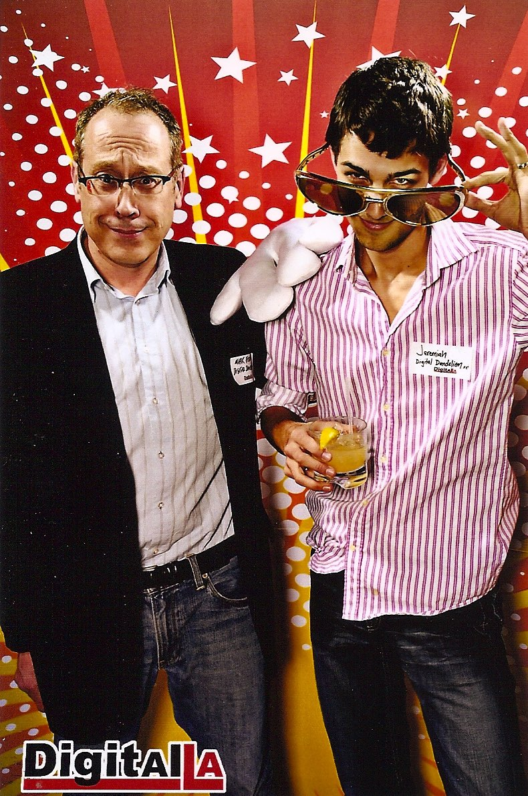

I lost one of my closest friends to cancer. Fucking cancer took another person I loved from me. I’m mad. I’m sad. I’m angry beautiful people like my mother and Mark Fish got plucked from Earth before their time while asswipes like Donald Trump seem to live forever.

Arthur and I flew back to California this weekend to celebrate Mark’s life with people who loved him. Mark only had a few requests for his funeral. He wanted his ashes spread in Bodega Bay, for Keto to sing “Amazing Grace”, and for Peter to play the cello. Mark shared these requests every time death seemed imminent during his four year battle with cancer. We never let him linger on this conversation topic. He rebounded several times and we hoped he would be in the 2% to survive past five years.

Mark introduced to many things: wine, cheeses other than American and Swiss, “Lawrence of Arabia”, Hemingway, [Jaron Lanier](https://amzn.to/2gWx1iA), and so much more. He was an amazing roommate, business co-founder, mentor, and friend.

As a business partner, I learned that when we disagreed, I was usually the one wrong. He had a sharp mind and a lot of experience.

He was the person I would run every crazy idea by first. He was the person who wanted to try every new app with me.

He was the biggest cheerleader I have ever had and likely will ever have. He promoted the hell out of everything I worked on, while giving me the constructive feedback I needed.

I loved him dearly. I often felt we were regular gifts to each other. My narrative is better because he was a character in it.

