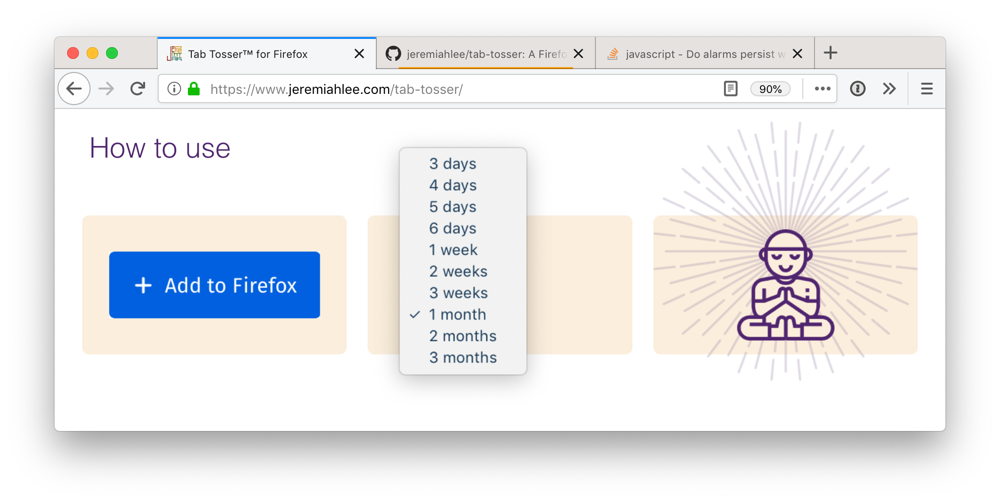
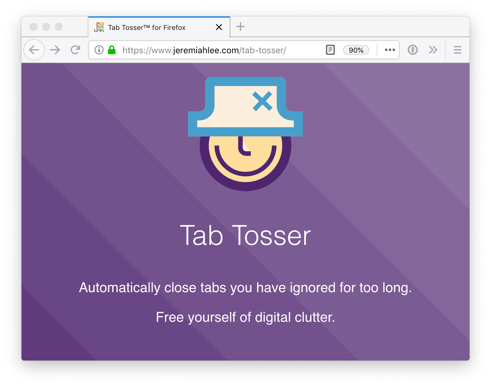
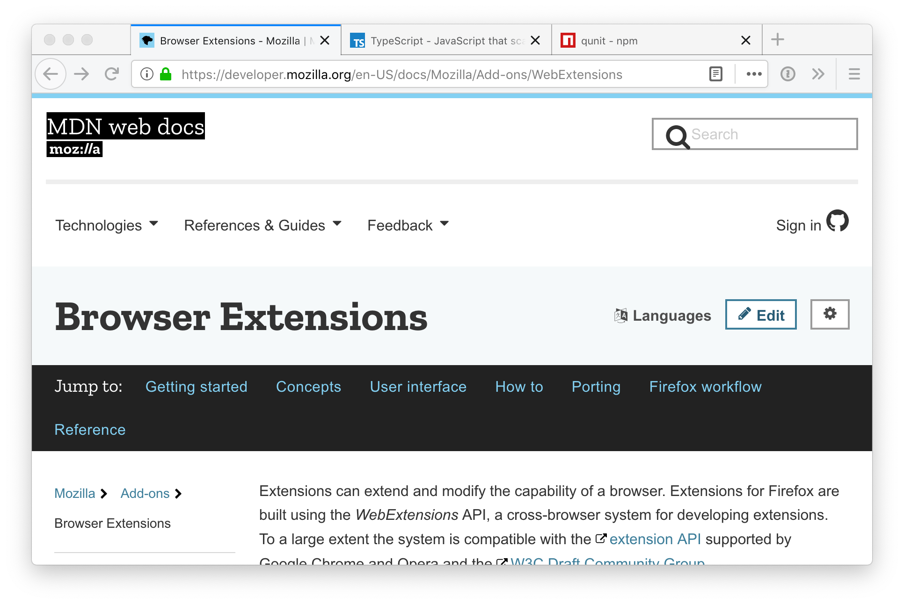
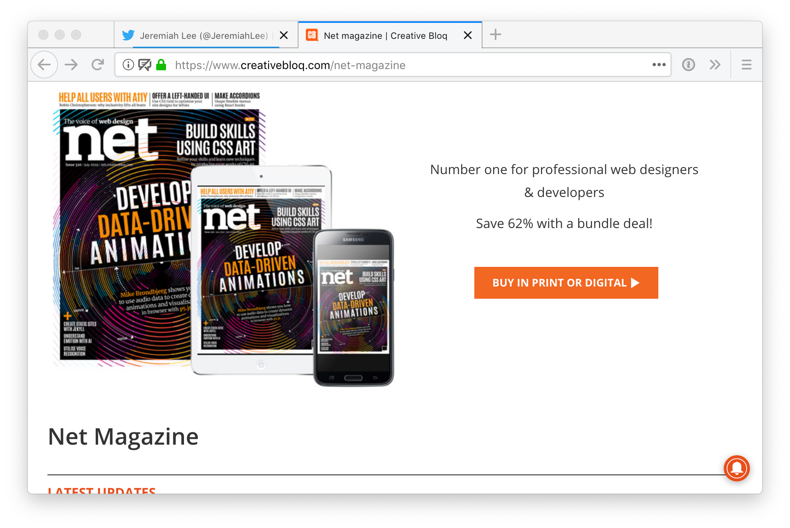

<!-- 

    
    
    
    

 -->

From my journal: July 19, 2017:

>  I have wanted to be in Net magazine for decades. In high school, I was obsessed with Computer Arts and Net magazine. They were expensive—over $10 an issue—and imported from the UK. I used to save to buy them. From a farmhouse, I dreamed of one day working at a visual effects studio in a fancy exposed brick studio somewhere in Europe like those featured in every issue.

[Tab Tosser](/tab-tosser/), one of my 12 side projects in 2019, was featured in Net magazine's "side project of the month" column in [issue 321](https://www.myfavouritemagazines.co.uk/design/net-magazine-back-issues/net-august-2019-issue-321/). Ironically, Net magazine does not make all of its content available online. Here are my _unedited_ answers from the interview on May 14, 2019.

**Tell us what your side project does.**

Tab Tosser is a Firefox extension that automatically closes browser tabs you have ignored. It tracks when browser tabs are last viewed and closes them when they have not been revisited for 1–90 days, based on your preference. If you go on vacation, Tab Tosser detects you have been away and pauses for a few days while you catch up. It also keeps a backup log of recently tossed tabs just in case.

**Why did you create it?**

A while ago, I reset Safari on my MacBook Pro while debugging a Web app, unaware that doing so also would clear the tabs and browsing history on my iPhone. I panicked when I realized what had happened. I took a few deep breaths and reconsidered if I had truly lost anything. I hadn’t. It was not like my home had burned down and I had lost personally invaluable memorabilia. I could search and find any website I had open. And if I couldn’t remember enough about the page to search for it, it wasn’t really that important.

**What were you hoping to achieve?**

I open tabs with full intention to take action, but life happens. Tabs build up. They become yet another task on my ever growing to-do list. Tab Tosser creates an intentional constraint that helps free myself of digital clutter with no effort. I built Tab Tosser for me, but I hope it helps others, too.

**What technologies were used in building it?**

Tab Tosser uses Firefox’s [WebExtensions API](https://developer.mozilla.org/en-US/docs/Mozilla/Add-ons/WebExtensions). It is written in [TypeScript](http://www.typescriptlang.org/) and compiled to ECMAScript 2017. This was my first project to use the [Tailwind CSS framework](https://tailwindcss.com/). I enjoyed using Tailwind so much that it now is my preferred CSS framework. For testing, I used the [QUnit](http://qunitjs.com/) CLI and Mozilla’s [`webextensions-api-fake`](https://github.com/webexts/webextensions-api-fake) library. I designed the icon and website in [InVision Studio](https://www.invisionapp.com/studio).

**How has it been received?**

Tab Tosser received more upvotes on [Product Hunt](https://www.producthunt.com/posts/tab-tosser) than monthly active users in its first month. I think people like the idea of Tab Tosser more than actually embracing the constraint, even if they genuinely believe it would help them live better.

Someone sent me a feature request to add a list of domains to never close. They said they had work documents they would never want to automatically close. I did not implement this feature because this sort of thinking precisely is what Tab Tosser is meant to change. If a tab is truly important to you, you will click on it within a reasonable amount of time.

Several people have written to thank me. One person said Tab Tosser helped them digitally in the way the [KonMari method](https://konmari.com/) helped them with physical objects.

**What do you think you'll do next with it?**

Tab Tosser changed my browsing behavior towards articles specifically. I now send articles I want to read to [Pocket](https://getpocket.com/) instead of opening in a tab. I blocked time on my calendar every day to read, but there are still articles I never get to. I am thinking about creating a similar expiration time extension to Pocket.

I also am considering making Tab Tosser available for [Brave](https://brave.com/) and Microsoft Edge. Google seems to have abandoned collaboration with Mozilla on a WebExtensions API standard and Chromium does not have the tab `lastAccessed` feature Tab Tosser relies on. I don’t know enough C++ to add the functionality to Chromium, but a JavaScript polyfill seems plausible.

*Jeremiah is an engineering manager at [InVision](https://www.invisionapp.com/). He grew under the Californian sun, but now calls Stockholm, Sverige home.*
