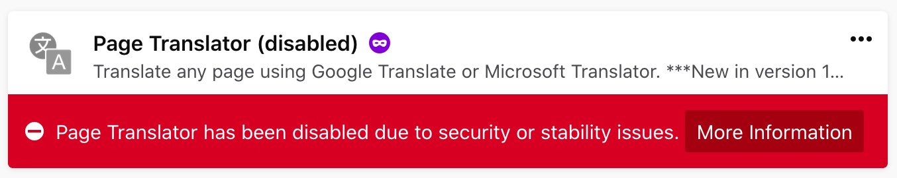
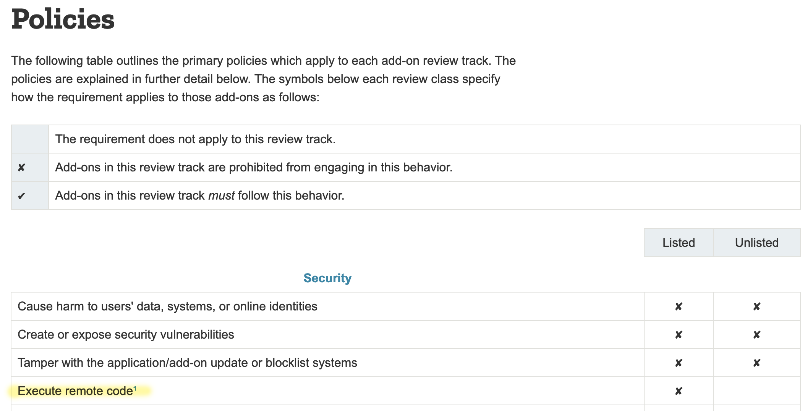

_**Summary:** Firefox has made the Web less accessible to people who need to access information in another language, taken an absolutist position, and removed freedom of users to extend their browser._

In-line language translation in the browser is a necessary feature for millions of people who do not speak the dominant languages online. Google Chrome and Microsoft Edge are the only browsers to offer in-browser language translation.

Both Google and Microsoft operate language translation services. They provide a JavaScript library website owners can add to their websites to allow in-line language translation. This allows website owners to offer their websites in another language for visitors who use browsers like Safari and Firefox that do not have in-line language translation built-in.

I created a Firefox extension ([Page Translator](https://github.com/jeremiahlee/page-translator/)) that inserts either the Google Translate or Microsoft Translator library into a webpage, as if the website owner had included it. This brought in-line language translation to Firefox users. Thousands of people used it and loved it.

Then, Mozilla killed it without discussion.

Mozilla tightened its add-on rules to not permit extensions from loading external JavaScript. Until some point recently, that rule only applied to add-ons distributed through addons.mozilla.org. Mozilla said I could self-distribute it as a side-loaded add-on. They don’t have a way to convert an add-on from a Mozilla-hosted add-on to a self-distributed add-on, so I created a new add-on in order to sign the code for distribution. I made it available for installation from [its Github repository](https://github.com/jeremiahlee/page-translator/).

<figure class="mb-4 text-sm">
    
    <figcaption><em>Screenshot of Mozilla Add-ons policy when Page Translator was last released, via the <a href="https://web.archive.org/web/20180311125311/https://developer.mozilla.org/en-US/Add-ons/AMO/Policy/Reviews">Internet Archive</a>.</em></figcaption>
</figure>

This morning, I opened up Firefox and wanted to translate a page in Swedish. I am an American living in Sweden and many government websites are only available in Swedish. I rely on in-line language translation in the browser to supplement my nascent Swedish literacy. Only, Page Translator had been removed from my browser, without my consent.

Mozilla remotely disabled Page Translator for the thousands of people who use it, once again, without warning and without contacting me, the developer. The add-ons manager in Firefox directed me to [a page explaining the removal](https://blocked.cdn.mozilla.net/9e8f80d6-a818-4004-9a20-deec55f3fb96.html) and this [Bugzilla ticket](https://bugzilla.mozilla.org/show_bug.cgi?id=1589974). I have emailed the AMO team for more information.

_**Update 2019-10-22:** [Mozilla responded](https://github.com/jeremiahlee/page-translator/issues/26#issuecomment-544544728) to my request for more information and confirmed the policy change and the block being permanent._

## Nuance should not be dead.

I understand and agree with a general policy of browser extensions needing to be self-contained. By distributing a browser extension, Mozilla is effectively vouching for its credibility. It cannot do that when an extension loads external, obfuscated code.

Page Translator, as explicitly stated to users, load Google Translator or Microsoft Translate. Page Translator adds these libraries as if they had been included on the webpage by the webpage author using the methods prescribed by Google and Microsoft to website owners. The code for loading these libraries is not obfuscated and is public. There is no deception on my part to the user or to Mozilla about the behavior of the add-on.

Mozilla could argue that loading these language translation libraries onto a page enables Google or Microsoft to track users. This is true, but Page Translator’s methods do not subvert Firefox’s cookie and tracker blocking. There is no technical difference between the Google Translate or Microsoft Translator JavaScript libraries being included by Page Translator than if it were included by the webpage author.

Beyond the absolute position in the policy of not loading external code, I do not believe Page Translator meets Mozilla’s [stated blocking criteria](https://developer.mozilla.org/en-US/docs/Mozilla/Add-ons/AMO/Blocking_Process#Blocking_Criteria) for security vulnerabilities, compromising user privacy, or circumventing user consent or control.

## Where do we go from here?

Non-viable options:

- Include the Google Translator and Microsoft Translate libraries in the browser extension. Mozilla prohibits inclusion of minified code. Also, these libraries dynamically include other libraries. Including them all would be fragile because the extension could break if they changed.
- Recreate the logic in the translation libraries. Google and Microsoft libraries do something special that permits them free use of their language translation APIs. The only way to properly integrate would be to pay. I can’t afford to pay for every Page Translator users' use of these APIs.
- Form a company that inexpensively sells in-page translation. Even a small cost is prohibitive to many people in the world. When people can just use Google Chrome or Microsoft Edge to translate a page for free, why would they pay?

Viable options:

- Mozilla picks pragmatism over absolutism. Users should have the option of accepting the risk of invoking a Google or Microsoft service in the browser. Mozilla has revoked power from people to decide if using a feature is an adequate privacy tradeoff for them. It could return that power to people.
- Mozilla natively adds full-page in-line language translation and allows stop-gap add-ons like Page Translator until it can natively release this feature.
  **Update 2019-10-22:** The good news is that [Mozilla appears to be working on this](https://www.trustedreviews.com/news/firefox-translation-bergamot-mozilla-3948613?utm_source=dlvr.it&utm_medium=twitter). Now, Mozilla needs to be pragmatic until it releases the translation feature. Otherwise, how many people are going to switch to Chrome in the interim and never switch back?

## I’m sorry.

To the thousands of people who used, loved, and relied on Page Translator, I am sorry. I solved my own need and met so many other people who had it as well. Your only option for full-page in-line translation is to switch to Chrome or Edge. I hate saying this. I believe the Chromium monoculture and Google’s surveillance capitalism are outright bad for the world. But it’s our only option for now.
