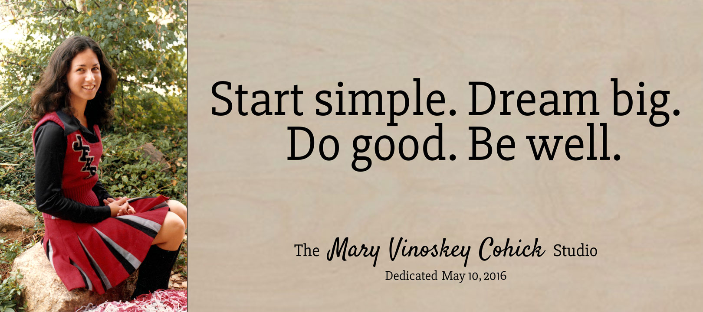

Today, on what would have been my mom&#8217;s 54th birthday, I had the honor of dedicating the new tv studio at our high school in her honor.

Arthur and I held a workshop with the students yesterday to teach some of the studio production techniques we learned in college and professionally. The students learned quickly and successfully pulled off their first live multi-camera shoot today. I&#8217;m proud of them and confident they&#8217;ll make some great media in the coming years.

Dedication transcript:

> Good morning, <acronym title="Jefferson Forest">JF</acronym>! I&#8217;m Jeremiah&#8230;and it&#8217;s been 14 years since I&#8217;ve said that. I was part of the first group of students to create _Cavalier Corner_. So why am I back? Well, when we started, we broadcasted from a small closet in the library with equipment older than us. It was a humble beginning.
>
> But when JF was renovated, a great new studio space was created. Today, I&#8217;m joined by friends and family to name the studio after my mom, Mary Vinoskey Cohick. She graduated from JF in 1980. We even had some of the same teachers, a generation apart. Unfortunately, she passed away when I was in 7th grade.
>
> One of the ways that I dealt with that pain was to get involved in my community and extracurricular activities. _Cavalier Corner_ gave me a reason to smile and say good morning, even when I didn&#8217;t feel it. That meant a lot to me. It was one of many opportunities to create that helped me find a successful career. I believe in paying good fortune forward, so I&#8217;ve helped get some new media equipment in this studio and I hope some of you will use it to create something.
>
> That&#8217;s the end of this announcement. I&#8217;ll leave you with my personal motto:
>
> Start simple.

> Dream big.

> Do good.

> Be well.
>
> Thanks for sharing this moment with me. From the <acronym title="Mary Vinoskey Cohick">MVC</acronym> Studio, go make it a good day.
