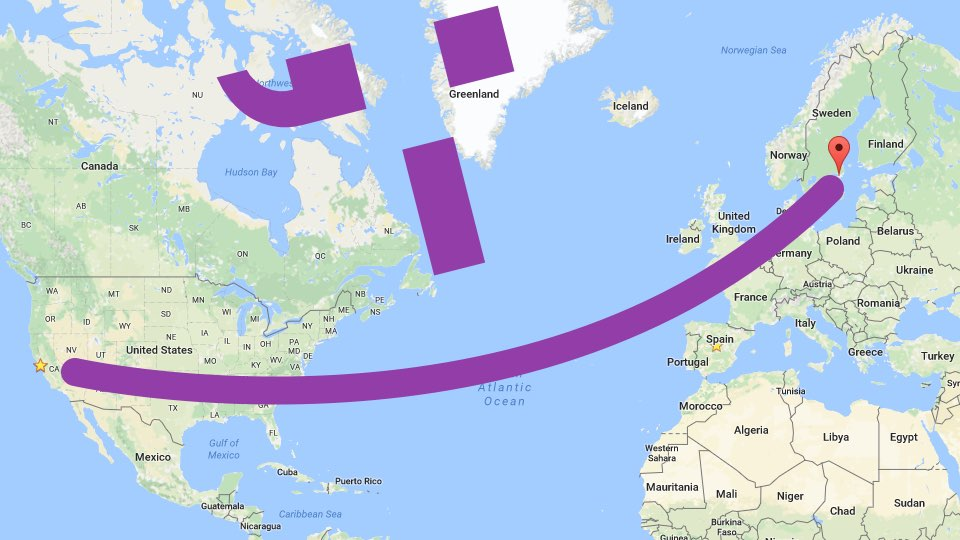

Arthur and I are moving to Stockholm, Sverige. Arthur accepted a job at Spotify. The position is exciting and a next-level opportunity for his career.<a href="#1">1</a>

I have now spent more of my life in California than any other state. I am fortunate to have lived in three of its great cities: San Diego, Los Angeles, and San Francisco. If you know me at all, you know I love California—especially San Francisco. I may have been born in Virginia, but San Francisco is where I'm from. When I board that plane to Stockholm with a flower in my hair, a part of my heart will be left here.

Sweden is one of the [happiest places on earth](http://www.cnn.com/2016/03/16/travel/worlds-happiest-countries-united-nations/ "Where are the world's happiest countries? – CNN") and I look forward to much happiness there. When I attended Emerson College, I was accepted into its [Kasteel Well program](http://www.emerson.edu/education-abroad-domestic-programs/kasteel-well-netherlands). Financial aid issues prevented me from being able to live that semester abroad, but I ended up meeting an incredible man to share my wanderlust with. Years later, an opportunity has arisen and I can't wait to seize it with the best fieldtrip buddy a guy could ask for.

The countdown starts now. Let's make the most of the next two-ish months. My San Francisco bucket list is long and I welcome company to check off a few items. If you'd like to hang out before an ocean divides us, get in touch. (We also plan to have a guest room in Stockholm and hope you'll make use of it.)

<small id="1">1: Fitbit is not able to employ me in Sverige. I will be looking for a new career opportunity when I move to Sverige in April.</small>
