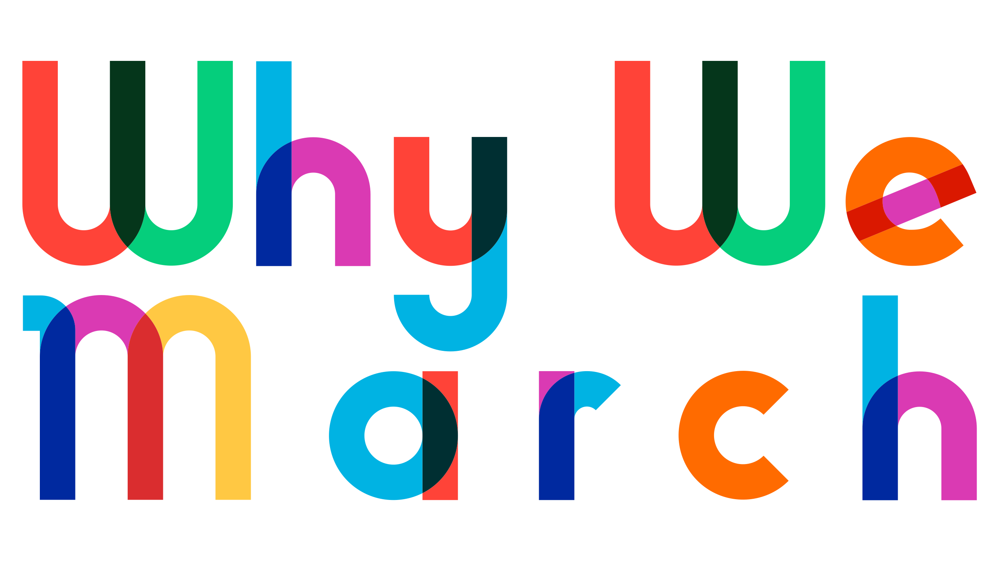

> "I’ve been thinking about my life and all of the mistakes that I’ve made, the ones that stay with me or the ones that I regret are the ones that I made because of fear. For a long time I was afraid to be who I am because I was taught by my parents that there’s something wrong with someone like me – something offensive, something you will avoid, maybe even pity.
>
> "Something that you could never love.
>
> "My mom—she’s a fan of St. Thomas Aquinas—and she calls pride a sin. And of all the venal and moral sins, St. Thomas saw pride as the queen of the seven deadly sins. He saw it as the ultimate gateway sin that would turn you quickly into a sinaholic. But hating isn’t a sin on that list. Neither is shame.
>
> "I was afraid of this parade because I wanted so badly to be a part of it. So today I’m marching for that part of me that was once too afraid to march and for all the people who can’t march: the people living lives like I did. Today I march to remember that I’m not just a me. I’m also a we and we march with pride.
>
> "So go fuck yourself, Aquinas."

—Sense 8, Episode 2: "I Am Also A We"

<small>Header set in <a href="https://www.typewithpride.com/?ref=JeremiahLee">Gilbert</a>.</small>
